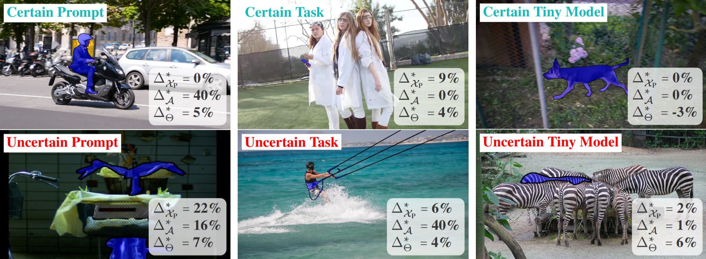
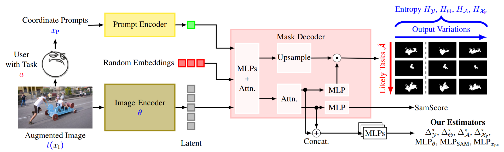
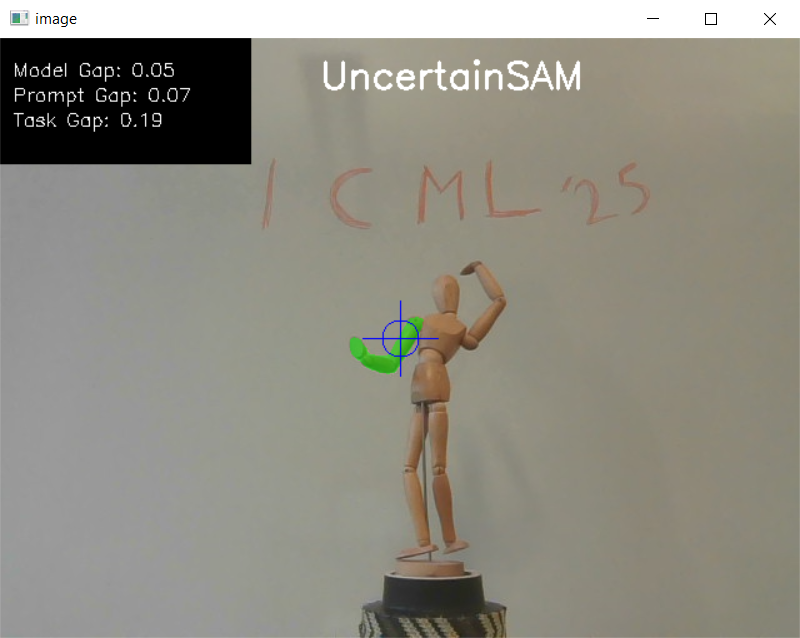

<div align="center"> 
    <h1> UncertainSAM: Fast and Efficient Uncertainty Quantification of the Segment Anything Model</h1>
</div>

<div align="center"> 


</div>

---

This is the code to the paper 
[**"UncertainSAM: Fast and Efficient Uncertainty Quantification of the Segment Anything Model"**](ARXIV_LINK_SOME_DAY) 
by Timo Kaiser, Thomas Norrenbrock, and Bodo Rosenhahn. 
The paper is accepted at the ICML 25.


<p align="center">

</p>

The introduction of the Segment Anything Model (SAM) has paved the way for numerous semantic segmentation applications. For several tasks, quantifying the uncertainty of SAM is of particular interest. However, the ambiguous nature of the class-agnostic foundation model SAM challenges current uncertainty quantification (UQ) approaches. This paper presents a theoretically motivated uncertainty quantification model based on a Bayesian entropy formulation jointly respecting aleatoric, epistemic, and the newly introduced task uncertainty. We use this formulation to train USAM, a lightweight post-hoc UQ method. Our model traces the root of uncertainty back to under-parameterised models, insufficient prompts or image ambiguities. Our proposed deterministic USAM demonstrates superior predictive capabilities on the SA-V, MOSE, ADE20k, DAVIS, and COCO datasets, offering a computationally cheap and easy-to-use UQ alternative that can support user-prompting, enhance semi-supervised pipelines, or balance the tradeoff between accuracy and cost efficiency.


<p align="center">

</p>


---

## Features at a glance

Installing this repository will provide you with the following features:
- Fast and efficient patch of SAM2 for uncertainty quantification
- Simple and intuitive demonstrator to visualize uncertainty in a video stream
- Training scripts to retrain the model 


---

## Installation

First, install ````python>=3.10````, as well as ````torch>=2.5.1```` and ````torchvision>=0.20.1````.
To make things easier, use our conda environment file:
```shell
conda env create -f environment.yml
```
We tested the installation on Linux Opensuse-leap 15.6 and Windows 10 with Python 3.10.


Our repository is build on the SAM2 repository. Thus, install SAM2.0 from the 
official repository [here](https://github.com/facebookresearch/sam2).

````shell
git clone https://github.com/facebookresearch/sam2.git && cd sam2
pip install -e ".[notebooks]"
````

Then, clone this repository and install it:
```shell
git clone https://github.com/GreenAutoML4FAS/UncertainSAM
cd UncertainSAM
pip install -e .
```

After the installation, you need to download the pre-trained model weights from the SAM2 repository.
Do this by running the official download links provided in 'models/sam/checkpoints_2.x'.

```shell
cd models/sam/checkpoints_2.0
./download_ckpts.sh

cd ../checkpoints_2.1
./download_ckpts.sh
```

You can verify the sam2 installation by running the following command:
```shell
python scripts/verify_sam2_installation.py
```
and the UncertainSAM installation by running:
```shell
python scripts/verify_usam_installation.py
```

**Known Issues:**
- Make sure that the sam2 repository is not in your working directory when you run the scripts. May you need to add it to the PYTHONPATH if its not found!
- SAM installs a specific version of opencv that does not support imshow, necessary to run the demo tool. To fix it, uninstall opencv via pip and reinstall the default opencv repository with pip.
---

## Usage

### API

The original SAM can be used as follows:
```python
import torch
from sam2.build_sam import build_sam2
from sam2.sam2_image_predictor import SAM2ImagePredictor

checkpoint = "./checkpoints/sam2.1_hiera_large.pt"
model_cfg = "configs/sam2.1/sam2.1_hiera_l.yaml"
predictor = SAM2ImagePredictor(build_sam2(model_cfg, checkpoint))

with torch.inference_mode(), torch.autocast("cuda", dtype=torch.bfloat16):
    predictor.set_image(<your_image>)
    masks, _, _ = predictor.predict(<input_prompts>)
```

You can patch and use it with the UncertainSAM as follows:
```python
import torch
from sam2.build_sam import build_sam2
from sam2.sam2_image_predictor import SAM2ImagePredictor

from usam.patch_sam2 import patch_sam2

checkpoint = "./models/sam/checkpoints_2.1/sam2.1_hiera_large.pt"
model_cfg = "${SAM_DIRECTORY}/configs/sam2.1/sam2.1_hiera_l.yaml"
predictor = SAM2ImagePredictor(build_sam2(model_cfg, checkpoint))

mlp_directory = "./models/mlps/sam2.1"
predictor = patch_sam2(predictor, mlp_directory)

with torch.inference_mode(), torch.autocast("cuda", dtype=torch.bfloat16):
    predictor.set_image(<your_image>)
    masks, _, _, mlp_scores = predictor.predict(<input_prompts>)

    for mlp, v in mlp_scores.items():
        print(f"MLP {mlp} has a score of {v}") 
```

### Demo

<p align="center">

</p>

You can run our USAM demo to visualize the uncertainty estimation in real-time:
```shell
python scripts/demo.py
```
To modify the script, please see the script for further information.

### Training

To retrain USAM on the proposed datasets, please read [TRAIN.md](docs/TRAIN.md) 
for further information.

---

## Citation


If you use this code in your research, please cite the following paper:

```
@inproceedings{
    kaiser2025uncertainsam,
    title={Uncertain{SAM}: Fast and Efficient Uncertainty Quantification of the Segment Anything Model},
    author={Timo Kaiser and Thomas Norrenbrock and Bodo Rosenhahn},
    booktitle={Forty-second International Conference on Machine Learning},
    year={2025},
    url={https://openreview.net/forum?id=G3j3kq7rSC}
}
```

---

## Acknowledgements

We thank the authors of the following repositories for providing their code:

- [Segment Anything (SAM)](https://github.com/facebookresearch/segment-anything)
- [Segment Anything 2 (SAM2)](https://github.com/facebookresearch/sam2)
