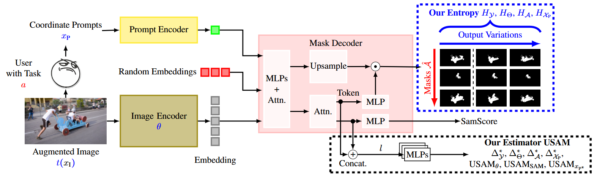

# CertainSAM
---

This is the code to the paper 
[**"CertainSAM: Fast and Efficient Uncertainty Quantification in the Segment Anything Model"**](ARXIV_LINK_SOME_DAY) 
by Anonymous Authors
which is submitted to the ICML25 double-blind review process.


**Please do not distribute!**


<p align="center">

</p>

The introduction of the Segment Anything Model
(SAM) has paved the way for numerous semantic segmentation applications. 
In critical environments, quantifying the uncertainty of SAM
is of particular interest. However, the ambiguous nature of the class-agnostic 
foundation model SAM challenges current uncertainty quantification (UQ) approaches. 
To provide new perspectives, this paper analyzes the interplay between
SAM and existing UQ approaches and formulates a Bayesian entropy approximation baseline.
Then, we introduce a lightweight post-hoc UQ
method that traces the root of uncertainty to under-parameterized models, 
insufficient prompts, or ambiguous images. Our deterministic UQ method
demonstrates impressive results on the SA-V, MOSE, ADE20k, DAVIS, and COCO 
datasets, offering a lightweight and easy-to-use UQ alternative that can guide 
users during prompting, enhance semi-supervised pipelines, or balance the
tradeoff between accuracy and cost efficiency.


<p align="center">

</p>


---

## Features at a glance

Installing this repository will provide you with the following features:
- Fast and efficient patch of SAM2 for uncertainty quantification
- Simple and intuitive demonstrator to visualize uncertainty in a video stream
- Training scripts to retrain the model

**Important Note:** 
The current version only supports the SAM2.0 model. 
We will also train the models for SAM2.1 in the future.
This repository is a research prototype and is not intended for production use. 
Please use it at your own risk. 
We will do our best to maintain the code and fix issues, 
but we cannot provide any support for it.

---

## Installation

First, install ````python>=3.10````, as well as ````torch>=2.5.1```` and ````torchvision>=0.20.1````.
To make things easier, use our conda environment file:
```shell
conda env create -f environment.yml
```
We tested the installation on Linux Opensuse-leap 15.6 and Windows 10 with Python 3.10.


Our repository is build ono the SAM2 repository. Thus, install SAM2.0 from the 
official repository [here](https://github.com/facebookresearch/sam2).

````shell
git clone https://github.com/facebookresearch/sam2.git && cd sam2
pip install -e ".[notebooks]"
````

Then, clone this repository and install it:
```shell
git clone TO_BE_ADDED_AFTER_PUBLICATION
cd CertainSAM
pip install -e .
```

After the installation, you need to download the pre-trained model weights from the SAM2 repository.
Do this by running the official download links provided in 'models/sam/checkpoints_2.x'.

```shell
cd models/sam/checkpoints_2.0
./download_ckpts.sh

cd ../checkpoints_2.1
./download_ckpts.sh
```
**Note that** the respective model configs can be found in the SAM2 repository.
Until now, only the SAM2.0 models are supported!

You can verify the sam2 installation by running the following command:
```shell
python scripts/verify_sam2_installation.py
```
and the CertainSAM installation by running:
```shell
python scripts/verify_usam_installation.py
```

**Known Issues:**
- Make sure that the sam2 repository is not in your working directory when you run the scripts. My you need to add it to the PYTHONPATH if its not found!

---

## Usage

### API

The original SAM can be used as follows:
```python
import torch
from sam2.build_sam import build_sam2
from sam2.sam2_image_predictor import SAM2ImagePredictor

checkpoint = "./checkpoints/sam2.1_hiera_large.pt"
model_cfg = "configs/sam2.1/sam2.1_hiera_l.yaml"
predictor = SAM2ImagePredictor(build_sam2(model_cfg, checkpoint))

with torch.inference_mode(), torch.autocast("cuda", dtype=torch.bfloat16):
    predictor.set_image(<your_image>)
    masks, _, _ = predictor.predict(<input_prompts>)
```

You can patch and use it with the CertainSAM as follows:
```python
import torch
from sam2.build_sam import build_sam2
from sam2.sam2_image_predictor import SAM2ImagePredictor

from usam.patch_sam2 import patch_sam2

checkpoint = "./models/sam/checkpoints_2.0/sam2_hiera_large.pt"
model_cfg = "${SAM_DIRECTORY}/configs/sam2/sam2_hiera_l.yaml"
predictor = SAM2ImagePredictor(build_sam2(model_cfg, checkpoint))

mlp_directory = "./models/mlps/sam2.0"
predictor = patch_sam2(predictor, mlp_directory)

with torch.inference_mode(), torch.autocast("cuda", dtype=torch.bfloat16):
    predictor.set_image(<your_image>)
    masks, _, _, mlp_scores = predictor.predict(<input_prompts>)

    for mlp, v in mlp_scores.items():
        print(f"MLP {mlp} has a score of {v}") 
```

### Demo

You can run our demo to visualize the uncertainty in a video stream:
```shell
python scripts/demo.py
```
To modify the script, please open the python see the script for further information.

### Training

Will be added soon.

---

## Citation


If you use this code in your research, please cite the following paper:

```
@article{,
  title={},
  author={},
  journal={},
  year={},
  publisher={}
}
```

---

## Acknowledgements

We thank the authors of the following repositories for providing their code:

- [Segment Anything (SAM)](https://github.com/facebookresearch/segment-anything)
- [Segment Anything 2 (SAM2)](https://github.com/facebookresearch/sam2)
