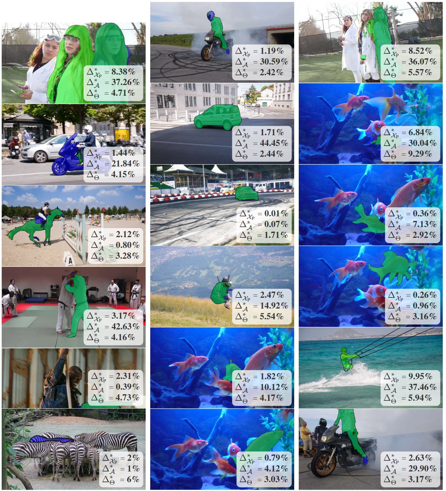

<div align="center"> 
    <h1> UncertainSAM: Fast and Efficient Uncertainty Quantification of the Segment Anything Model</h1>
</div>

<div align="center"> 
<a href="https://arxiv.org/abs/2505.05049">
  
</a>
<a href="https://openreview.net/forum?id=G3j3kq7rSC">
  
</a>
<a href="https://greenautoml4fas.github.io/UncertainSAM/">
  
</a>
<a href="https://github.com/GreenAutoML4FAS/UncertainSAM">
  
</a>
</div>

---

<p style="font-style: italic; background-color: #f0f0f0; padding: 10px; display: inline-block; text-align: justify;">
The introduction of the Segment Anything Model (SAM) has paved the way for numerous semantic segmentation applications. For several tasks, quantifying the uncertainty of SAM is of particular interest. However, the ambiguous nature of the class-agnostic foundation model SAM challenges current uncertainty quantification (UQ) approaches. This paper presents a theoretically motivated uncertainty quantification model based on a Bayesian entropy formulation jointly respecting aleatoric, epistemic, and the newly introduced task uncertainty. We use this formulation to train USAM, a lightweight post-hoc UQ method. Our model traces the root of uncertainty back to under-parameterised models, insufficient prompts or image ambiguities. Our proposed deterministic USAM demonstrates superior predictive capabilities on the SA-V, MOSE, ADE20k, DAVIS, and COCO datasets, offering a computationally cheap and easy-to-use UQ alternative that can support user-prompting, enhance semi-supervised pipelines, or balance the tradeoff between accuracy and cost efficiency.
</p>

This project page guides you through the main contributions of our work, provides an overview of the method, and 
presents the evaluation results by showing tables and figures from the original work. 
For more details, please refer to our [paper](https://openreview.net/forum?id=G3j3kq7rSC).

---

<div align="center"> 
    <h2> Method </h2>
</div>

<p align="center">

</p>

<p style="text-align: justify;">
<b>Figure 2:</b>
The SAM framework with our USAM extension and Bayesian entropy approximation to quantify uncertainty. Starting from the the bottom left, an image x_I is the input. A user defines one or more coordinate prompts x_P to specify his desired segmentation task <i>a</i>. The image and prompt are encoded into embeddings, concatenated together with random embeddings, and fed into the mask decoder which applies attention, MLPs and upsampling layers. The SAM framework estimates three potential masks that address different tasks. Additionally, SAM estimates the IoU between the ground truth of <i>a</i> and the masks corresponding to \hatA, denoted as <i>SamScore</i>. We extract and concatenate the mask and confidence tokens to train MLPs that estimate the expected predictive, epistemic, task, and prompt uncertainty. Furthermore, the process to calculate the entropy of uncertainty is visualized in blue. Multiple prompts are chosen by the user, augmentations <i>t</i> are applied to the input, and models of different size theta are used to apply variational inference.
The first row shows the gap between the simple and cheap predictions of the <i>Tiny</i> model and the refined predictions of the <i>Large</i> model. The second row shows the gap between the simple and cheap predictions of the <i>Tiny</i> model and the refined predictions of the <i>Large</i> model.
The second row shows the gap when using a single point coordinate as prompt and the refined predictions with a prompt that consists of a dense set of coordinates.
Finally, the third row shows the gap when using the mask selected by the <i>SamScore</i> and the best mask in \hatA with respect to the ground truth.
</p>

<p align="center">

</p>

<p style="text-align: justify;">
<b>Figure 3:</b>
Training objectives of our MLPs. They estimate the gap between simple and cheap (left) and refined (right) predictions.
</p>


 
---

<div align="center"> 
    <h2> Evaluation </h2>
</div>

<p align="center">

</p>

<p style="text-align: justify;">
<b>Figure 5:</b>
Performance gain while improving predictions selected with UQ on the COCO dataset. We evaluate the
<i>SamScore</i>, mask entropy H_Std, the Bayesian entropy approximations H_Y, H_A, H_X_P, H_Theta and our USAM_theta, Delta*_A$, Delta*_X_P, Delta*_Theta. The dashed line denotes an oracle estimation. Beginning from left to right, the first plot shows the improvement when replacing a ratio of the most uncertain predictions of the <i>Tiny</i> model with the <i>Large</i> models. The second plot shows the improvement, when using refined prompts to the most uncertain samples. The third and forth, when the best mask in \hatA is selected ignoring the <i>SamScore</i> and if a ratio of the most uncertain predictions is replaced by the ground truth. It shows that our MLPs are consistently superior to all other methods or on-par with the Bayesian approximation.
</p>


<p align="center">

</p>

<p style="text-align: justify;">
<b>Table 7:</b>
Runtime of SAM with and without UQ methods on a regular image performed on a NVIDIA RTX3050 Ti. 
Entropy is calculated on SAMs logit map, |T| and |X_P| denote the number of applied image 
and prompt augmentations used for MC sampling, and USAM contains the calculation of all our proposed MLPs. 
Compared to the runtime of all other UQ methods, our USAM is faster and easier to implement.
</p>

---

<div align="center"> 
    <h2> More Insights </h2>
</div>

<p align="center">

</p>
<p style="text-align: justify;">
<b>Table 5: </b>
Pearson correlation between different UQ measures on the COCO validation dataset using by the <i>Large</i> SAM model. IoU_GT denotes the real intersection over union between SAMs prediction and the ground truth.
</p>

<p align="center">

</p>
<p style="text-align: justify;">
<b>Table 6:</b>
Token ablation. The UQ performance of USAM when removing mask or IoU tokens from the MLP input on the COCO dataset, measured in relative AUC as in the main experiments. 
</p>

---

<div align="center"> 
    <h2> Samples </h2>
</div>

Blue masks are ground truth and the green masks are the predictions of the <i>tiny</i> SAM model. 
Delta*_A, Delta*_X_P, and Delta*_Theta are the uncertainty estimates of USAM for the task, prompt, and model uncertainty, respectively.

<p align="center">

</p>

<p align="center">

</p>

<p align="center">

</p>

---

## Citation


If you use this code in your research, please cite the following paper:

```
@inproceedings{
  kaiser2025uncertainsam,
  title={Uncertain{SAM}: Fast and Efficient Uncertainty Quantification of the Segment Anything Model},
  author={Timo Kaiser and Thomas Norrenbrock and Bodo Rosenhahn},
  booktitle={Forty-second International Conference on Machine Learning},
  year={2025},
  url={https://openreview.net/forum?id=G3j3kq7rSC}
}
```
