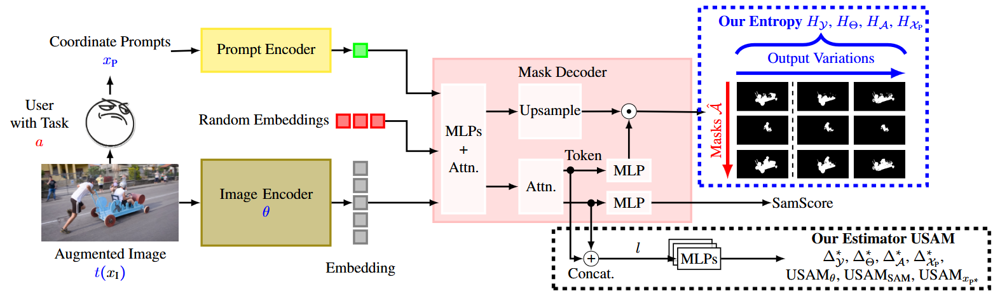
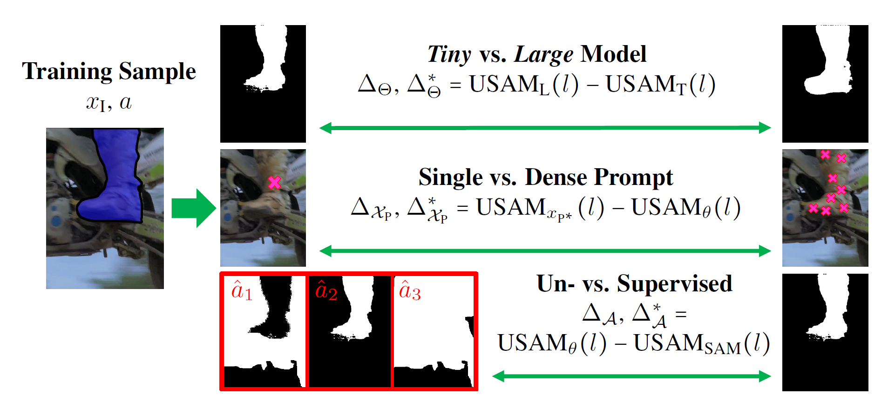
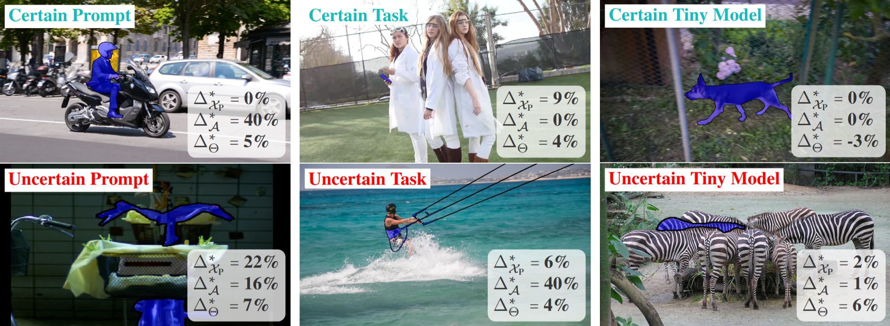
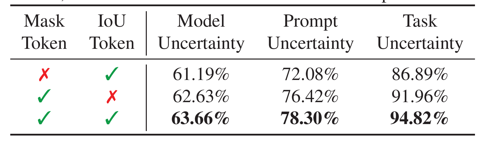
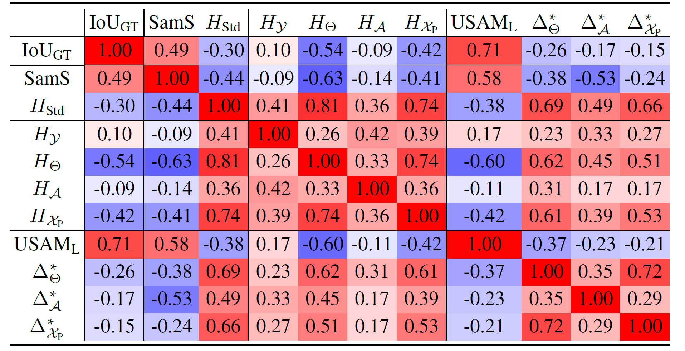
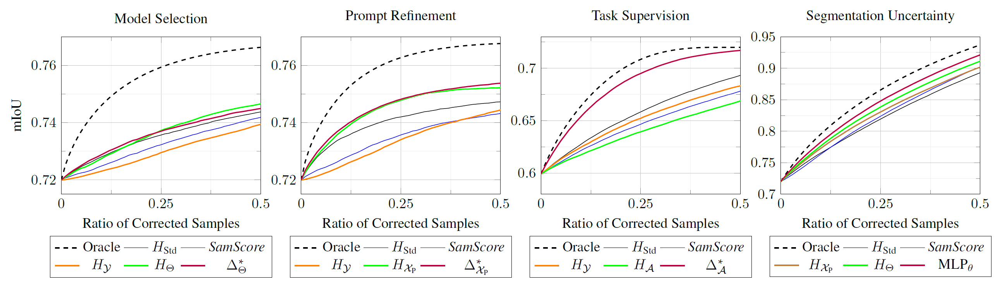
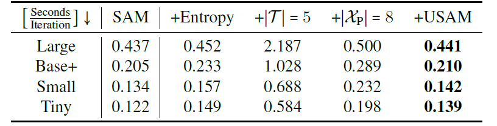

<div align="center"> 
    <h1> UncertainSAM: Fast and Efficient Uncertainty Quantification of the Segment Anything Model</h1>
</div>

<div align="center"> 
<a href="https://arxiv.org/abs/2505.05049">
  
</a>
<a href="https://openreview.net/forum?id=G3j3kq7rSC">
  
</a>
<a href="https://greenautoml4fas.github.io/UncertainSAM/">
  
</a>
<a href="https://github.com/GreenAutoML4FAS/UncertainSAM">
  
</a>
</div>

---

<p style="font-style: italic; background-color: #f0f0f0; padding: 10px; display: inline-block;">
The introduction of the Segment Anything Model (SAM) has paved the way for numerous semantic segmentation applications. For several tasks, quantifying the uncertainty of SAM is of particular interest. However, the ambiguous nature of the class-agnostic foundation model SAM challenges current uncertainty quantification (UQ) approaches. This paper presents a theoretically motivated uncertainty quantification model based on a Bayesian entropy formulation jointly respecting aleatoric, epistemic, and the newly introduced task uncertainty. We use this formulation to train USAM, a lightweight post-hoc UQ method. Our model traces the root of uncertainty back to under-parameterised models, insufficient prompts or image ambiguities. Our proposed deterministic USAM demonstrates superior predictive capabilities on the SA-V, MOSE, ADE20k, DAVIS, and COCO datasets, offering a computationally cheap and easy-to-use UQ alternative that can support user-prompting, enhance semi-supervised pipelines, or balance the tradeoff between accuracy and cost efficiency.
</p>

---
Method

<p align="center">

</p>

Training Objectives
<p align="center">

</p>


Samples

<p align="center">

</p>

Ablation
<p align="center">

</p>

Correlation
<p align="center">

</p>

Experiments
<p align="center">

</p>

Runtime
<p align="center">

</p>


---

## Citation


If you use this code in your research, please cite the following paper:

```
@inproceedings{
  kaiser2025uncertainsam,
  title={Uncertain{SAM}: Fast and Efficient Uncertainty Quantification of the Segment Anything Model},
  author={Timo Kaiser and Thomas Norrenbrock and Bodo Rosenhahn},
  booktitle={Forty-second International Conference on Machine Learning},
  year={2025},
  url={https://openreview.net/forum?id=G3j3kq7rSC}
}
```
